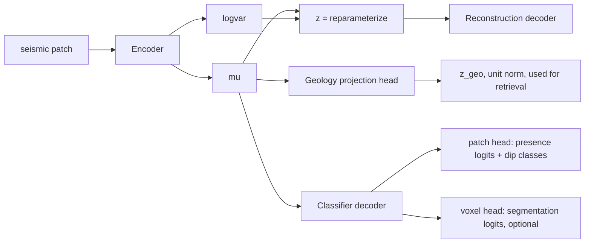

# Geology Classifier Decoder + Class-Anchored Sampling — Implementation Plan

Date: 2026-09-25
Parent plan: [2026-09-01_geo-aware_improvement_plan.md](../training/2026-09-01_geo-aware_improvement_plan.md)

This plan is written so a Copilot agentic model can implement it autonomously, one work
package (WP) at a time, with a test gate and a benchmark gate after each.

---

## 1. Goal and how it maps to the parent plan

**Primary goal (unchanged from the parent plan):** improve latent-space retrieval so patches
with similar geology rank near each other by cosine similarity of `z_geo`, as used by the
`seismic_tokenizer` similarity search.

- **Primary metric:** `diagnostics.neighbor_overlap_at_5` (n@5) on the frozen 7-key manifest
  `docs/benchmarks/frozen_validation_manifest.json`, tie-broken by n@10.
- **Current best:** Phase 2 epoch-20 `z_geo`, `checkpoints/geoaware_v3_phase2_20260831/vae_epoch20.pt`
  (n@5 0.139, n@10 0.227).
- **Guardrail:** reconstruction `val_loss` must not regress materially (Section 7).
- **Target:** n@5 in the 0.18–0.25 band.

The parent plan says the current recipe has converged, so gains need a structural change. This
plan implements two of its levers:

| This plan | Parent-plan lever | Why it should raise n@5 |
|---|---|---|
| Multi-task **classifier decoder** on `mu` (faults, fault intersections, dip class, dip-range class, channels, closures, onlaps, sand, flat spot) | **B. Richer geology labels** (ideas 2 and 3) | Direct supervised signal forces the shared encoder to encode each geology class in `mu`, which `z_geo` is projected from. Adds dip and closure information that the current 7 contrastive keys lack. |
| **Class-anchored patch sampling** + class-aware batch sampler | **A. More diverse data** and **C. positive/negative mining** | Rare classes (fault intersections, flat spots, channels) become common enough for both the classifier and SupCon to learn from, and batches are guaranteed to contain positives for them. |

Out of scope here (kept for later, per the parent plan's sequencing): D1 bigger projection
head, C2 embedding-indexed mining, D2 bigger encoder. This plan must not re-enable the
uniformity regularizer (`--geology_uniformity_weight 0`).

---

## 2. Evidence this plan is based on

Measured on the source data (`/Volumes/CrucialX9/fake_data`, 205 volumes) on 2026-09-25.

### 2.1 Label availability (source `model_data.zarr`)

| Class | Source array | Type | Notes |
|---|---|---|---|
| fault | `fault_segments_id` | uint32 id | > 0 = fault |
| fault intersection | `fault_intersection_segments` | float32 | > 0 = intersection; rarest class |
| channel | `faults/faulted_channel_labels` | uint8 | > 0 channel, ≥ 2 channel core |
| closure | `closure_segments_id` | uint16 id | present in 200 of 205 volumes; also `oil/gas/brine/simple/strat/faulted_closures` (uint8) |
| onlap | `onlap_segments` | float32 continuous [0, 1] | needs a threshold |
| sand | `faulted_lithology` | float32 | **−1 = water (above seabed), 0 = shale, 1 = sand**, fractions at boundaries |
| flat spot | `flat_spot` | uint8 | 0/1 |
| dip / dip range | derived from `geologic_age_faulted` | float32 | new `meta_dip_*_class` fields (Section 2.3) |

Label arrays have depth **1510**; seismic (`seismicCubes_cumsum_fullstack`) has depth **1499**.
Alignment **verified in WP0**: `seismic[z] ↔ label[z + 1]` (`--label_z_offset 1`); the 10 pad samples
are at the bottom. See [WP0 session](../sessions/2026-09-25-wp0-label-seismic-alignment.md).

### 2.2 Class imbalance per 32×32×64 patch (6 volumes, 1,800 patches per sampler)

| Class present in patch | Uniform | Current (`geologic_score`) | Class-anchored (simulated) |
|---|---:|---:|---:|
| fault | 0.227 | 0.302 | 0.403 |
| fault intersection | 0.021 | 0.025 | 0.122 |
| flat spot | 0.055 | 0.111 | 0.252 |
| onlap | 0.216 | 0.301 | 0.386 |
| channel | 0.068 | 0.104 | 0.200 |
| closure | 0.158 | 0.267 | 0.399 |
| none of the six | 0.525 | 0.373 | 0.162 |

The simulated class-anchored sampler used quotas of 1/8 per rare class and 2/8 background,
with the anchor voxel placed at a random position inside the patch; it produced no duplicate
origins.

### 2.3 Metadata already added (2026-09-25, in `scripts/sample_patches.py`)

- `meta_dip_range_deg` (p90 − p10 of voxel dip in the patch).
- `meta_dip_mean_class` and `meta_dip_range_class`: 6 classes (0–5) with edges
  `DIP_MEAN_CLASS_EDGES_DEG = (10, 20, 30, 40, 50)` and
  `DIP_RANGE_CLASS_EDGES_DEG = (8, 12, 16, 24, 32)`, recorded in output attrs.
- On 200 real patches every class was populated
  (dip mean `{0:6, 1:46, 2:62, 3:34, 4:29, 5:23}`, dip range `{0:12, 1:46, 2:42, 3:60, 4:27, 5:13}`).
- Dip is apparent dip in voxel-index space, not true dip.

### 2.4 Known defects to fix first

1. **Sand/shale fractions are wrong.** Current code maps lithology with `(x + 1) / 2`, so shale
   (0) counts as 0.5 sand and water (−1) counts as shale.
2. **Train/validation leakage.** `scripts/train_vae3d.sh` samples training patches from
   `/Volumes/CrucialX9/fake_data`, and `sample_patches.py` uses `rglob`, which also finds the
   25 volumes in `fake_data/validation`. `scripts/geoaware_next_steps.sh` has the same issue.
3. **Default `--seismic_key` is wrong.** Default `seismicCubes_cumsum__fullstack` (double
   underscore) exists in 0 of 205 volumes; the shell scripts pass the correct
   `seismicCubes_cumsum_fullstack`.

---

## 3. Architecture



### 3.1 `GeologyClassifierDecoder` (new, `src/model.py`)

Input is **`mu`** (deterministic, same tensor that feeds `z_geo`), not the sampled `z`, so the
classifier shapes exactly the representation used for retrieval.

Two output heads, selected by `--geology_classifier_mode {patch,voxel,both}`:

**Patch head (Stage 1, default):** `Linear(latent_dim→256) → LayerNorm → GELU → Dropout(0.1)`,
then:

| Output | Shape | Activation / loss | Target |
|---|---|---|---|
| presence logits | `(B, 7)` for fault, fault_x, channel, closure, onlap, sand, flat_spot | sigmoid, BCE with `pos_weight` or focal | `label_presence_<class>` |
| dip mean class | `(B, 6)` | softmax, CE with label smoothing 0.05 | `meta_dip_mean_class` (one-hot) |
| dip range class | `(B, 6)` | softmax, CE with label smoothing 0.05 | `meta_dip_range_class` (one-hot) |

**Voxel head (Stage 2, optional):** mirror of `Decoder` (`fc → unflatten → 3× upsample +
Conv3dBlock`) with `out_ch = 7` logits for the same seven binary classes at full patch
resolution. Loss = focal (γ = 2) + soft Dice per class. Voxels with water
(`faulted_lithology == −1`) are masked out of the sand loss.

Design rules:

- The existing `Decoder`, `GeologyProjectionHead`, and `forward()` return signature stay
  unchanged. Add `model.classify(mu)` returning a dict of logits.
- Constructor flags: `geology_classifier=False`, `geology_classifier_mode='patch'`,
  `geology_classifier_hidden=256`. Save these in the checkpoint config like the other
  architecture flags.
- Resume/warm-start allowlist in `scripts/train.py` (near `allowed_ds_missing`) must tolerate
  missing/unexpected `geology_classifier.*` keys, the same way it tolerates `geology_head.*`.
- `src/tokenizer/core/model_adapter.py` must ignore `geology_classifier.*` keys when loading,
  matching the existing `decoder.aux_head_` / `geology_head.` filter.

### 3.2 Loss

```
total = recon + kl_weight * KL + lpips_weight * LPIPS
      + geology_contrastive_weight * SupCon(z_geo)        (existing)
      + geology_classifier_weight * L_cls                 (new)

L_cls = mean_c BCE_or_focal(presence_c) + CE(dip_mean_class) + CE(dip_range_class)
      [+ voxel_weight * mean_c (focal_c + dice_c)]        (voxel mode)
```

- `pos_weight` per class = `clip(n_neg / n_pos, 1, 50)`, computed once from the training split
  and saved in the checkpoint.
- Start `--geology_classifier_weight 0.1`. Reconstruction loss is about 0.25 in the v1b
  history (Section 8.1) and initial BCE is about 0.69 per class, so 0.1 keeps the new term at
  roughly a quarter of reconstruction at the start.
- Gradients from `L_cls` flow into the encoder through `mu`; their size is controlled by the
  existing `--encoder_lr_mult` (Phase 2 used 0.1).

---

## 4. Class-anchored sample generation (`scripts/sample_patches.py`)

### 4.1 New CLI flags (existing behavior stays the default)

| Flag | Default | Meaning |
|---|---|---|
| `--sampling_mode {geoscore,class_anchored,uniform}` | `geoscore` | Current behavior unless changed |
| `--class_quotas fault=0.125 fault_x=0.125 ...` | 1/8 each rare class | Share of anchors per class |
| `--background_fraction` | `0.25` | Share of uniform (non-anchored) patches |
| `--anchor_jitter {uniform,center}` | `uniform` | Where the anchor voxel lands in the patch |
| `--max_patches_per_object` | `8` | Cap per distinct segment id (faults, closures, intersections) to limit memorization |
| `--anchor_index_max_coords` | `200000` | Reservoir-sample cap on stored coordinates per class per volume |
| `--presence_min_voxels` | `32` | Minimum voxels for `label_presence_<class> = 1` |
| `--onlap_threshold` | `0.5` | Threshold on `onlap_segments` |
| `--sand_threshold` | `0.5` | Threshold on `faulted_lithology` for sand |
| `--store_label_patches` | off | Also store `(N, 7, X, Y, Z)` uint8 label patches for voxel mode |
| `--exclude_dir NAME` (repeatable) | none | Skip source volumes under a folder name, e.g. `validation` |
| `--label_z_offset` | `0` | Depth offset between label and seismic arrays (set from WP0) |

### 4.2 Algorithm (per volume)

1. Build an **anchor index** chunk by chunk (never load a full 300×300×1510 label array at
   once): for each class, collect voxel coordinates that satisfy the class rule and are valid
   patch anchors, reservoir-sampled to `--anchor_index_max_coords`.
2. For each patch slot: choose a class by quota; if that class has no coordinates in this
   volume, fall back to background and count the fallback.
3. For a class anchor, pick a random coordinate, then set origin
   `o = clip(anchor − U[0, patch_size), 0, shape − patch_size)`.
4. Enforce `--max_patches_per_object` using segment ids where available.
5. Compute metadata (existing function) plus per-patch fields below.

### 4.3 New per-patch output arrays

| Array | dtype | Purpose |
|---|---|---|
| `label_presence_<class>` (7 arrays) | uint8 | Targets for the patch head and batch strata |
| `anchor_class` | int8 | Class used to anchor (−1 = background) |
| `inclusion_weight` | f4 | natural class share ÷ quota share; for de-biased calibration and eval |
| `label_patches` (optional) | uint8 `(N, 7, X, Y, Z)` | Voxel-mode targets |

Attrs to add: `sampling_mode`, `class_quotas`, `background_fraction`, `presence_min_voxels`,
`onlap_threshold`, `sand_threshold`, `label_z_offset`, `label_class_order`, per-class fallback
counts, and per-class anchored counts.

Storage: `label_patches` adds 7 one-byte channels per voxel, about 1.75× the current float32
patch storage. Chunk `(1, 7, X, Y, Z)`.

### 4.4 Metadata fixes in the same WP

- Sand/shale: `rock = lith >= 0`; `meta_sand_fraction = mean(lith[rock] >= sand_threshold)`;
  `meta_shale_fraction = 1 − meta_sand_fraction` over rock only; both 0 if a patch is all
  water. Add `meta_water_fraction`.
- Add `meta_closure_fraction` from `closure_segments_id > 0`.
- Fix the default `--seismic_key` to `seismicCubes_cumsum_fullstack`.

---

## 5. Training-time batch sampler (`src/geology_sampler.py`, `scripts/train.py`)

The existing `GeologyAwareBatchSampler` builds strata by thresholding calibrated metadata. Add
a label-driven mode alongside it; keep the current behavior as the default.

- New flag `--geology_strata_source {metadata,presence_labels}`. With `presence_labels`,
  `build_multilabel_strata` uses the `label_presence_<class>` arrays directly (no thresholds on
  calibrated continuous values, which removes one source of label noise).
- New flag `--geology_batch_class_quota` (e.g. `fault_x=2 flat_spot=2 channel=2`): minimum
  number of samples per batch containing each listed class, filled before the existing
  background/hard/negative steps.
- Positive pairs for SupCon: prefer pairs that share a rare presence class.
- Use `inclusion_weight` when fitting `fit_geology_metadata_calibration` so calibration reflects
  natural prevalence, not the rebalanced training set.
- Log new sampler stats per epoch: achieved per-class share, quota fallbacks, unique segment
  ids per batch.

**Batch size:** Phase 2 uses 12. With 7 rare classes, a per-class quota of 2 would fill the
whole batch. Use quotas only for the 3 rarest classes (fault intersection, flat spot, channel)
at 1–2 each, or raise `--batch_size` to 16–24 if memory allows (test on MPS first).

---

## 6. Work packages

Each WP ends with: new/updated unit tests passing (stdlib `unittest`), the existing suite
passing, and, where training is involved, a benchmark on the frozen manifest.

### WP0 — Verify label/seismic depth alignment (blocking for voxel mode)

- Read the synthoseis code in `/Users/donaldpg/synthoseis` for how the 1510 vs 1499 depth
  difference arises (padding, crop, or convolution trim).
- Empirically confirm: cross-correlate lithology boundary depth with seismic reflection
  envelope along traces for a range of offsets (−15 … +15); pick the offset with peak
  correlation across ≥ 5 volumes.
- Output: a value for `--label_z_offset` and a short note in the session summary.
- **Gate:** patch-level presence (Stage 1) tolerates an offset of a few samples; voxel mode
  (Stage 2) must not start until this is settled.

### WP1 — Data fixes and metadata

- Sand/shale fix, `meta_water_fraction`, `meta_closure_fraction`, seismic key default,
  `--exclude_dir`.
- Tests: synthetic volume with known water/shale/sand layout gives exact fractions; excluded
  folder volumes are never listed; default seismic key matches the fixture key.

### WP2 — Class-anchored sampler

- Implement Section 4.
- Tests:
  - With `--sampling_mode geoscore`, output is identical to the current code for a fixed seed
    (regression test).
  - Anchored patches always contain their anchor class (voxel count ≥ 1).
  - Achieved class shares are within ±3 percentage points of quotas on a synthetic volume.
  - Fallback to background when a class is absent; fallback counts recorded in attrs.
  - `--max_patches_per_object` is honored.
  - `inclusion_weight` is finite and positive; label patch shapes and dtypes are correct.
  - Anchor index memory: build the index from a chunked synthetic array without loading it
    whole (assert on chunk-read count or peak array size).

### WP3 — Classifier decoder (patch mode)

- Implement Section 3 (patch head only), the loss, flags, checkpoint config, resume
  allowlist, and tokenizer adapter filter.
- New flags in `scripts/train.py`: `--geology_classifier`, `--geology_classifier_mode`,
  `--geology_classifier_hidden`, `--geology_classifier_weight`,
  `--geology_classifier_loss {bce,focal}`, `--geology_classifier_focal_gamma`,
  `--geology_classifier_label_smoothing`, `--geology_classifier_classes` (default all 9 targets).
- Guard: `--geology_classifier_weight > 0` requires `--geology_classifier` and the presence
  arrays in the dataset; fail with a clear error otherwise.
- Tests:
  - Output shapes for each head; logits finite.
  - Loss decreases on a tiny separable synthetic batch in ≤ 50 steps.
  - `pos_weight` computation on known counts.
  - Warm-start from a checkpoint without the classifier loads with only `geology_classifier.*`
    missing; resume from a checkpoint with it restores exactly.
  - Tokenizer adapter loads a classifier-enabled checkpoint and produces identical `z_geo` to
    the same weights without the classifier keys.
  - With `--geology_classifier` off, training output for a fixed seed is unchanged
    (regression).

### WP4 — Label-driven batch sampler

- Implement Section 5.
- Tests: strata from presence labels match expected signatures; per-batch class quotas met
  when feasible and reported as fallbacks when not; calibration with `inclusion_weight` equals
  calibration on an equivalent natural-prevalence dataset (within tolerance).

### WP5 — Evaluation additions

- Extend `scripts/evaluate_geology_benchmark.py` (keep existing outputs and flags):
  - Per-class AUROC and average precision, macro-F1 at a threshold tuned on train, dip-class
    accuracy and confusion matrix.
  - n@5 / n@10 unchanged and still primary.
- Evaluate on a **natural-prevalence** validation set (uniform sampling from
  `fake_data/validation`), never on the anchored training distribution.
- The frozen manifest and its validation data stay fixed so results compare to 0.139.

### WP6 — Voxel mode (after WP0 and only if WP3 improves n@5)

- Voxel head, `--store_label_patches`, focal + Dice loss, water mask for sand.
- Tests: output shape equals patch shape × 7; Dice loss equals 0 for a perfect prediction;
  masked voxels contribute nothing to the loss.

### WP7 — Scripts and docs

- Add `scripts/geoaware_classifier_suite.sh` implementing Section 8 end to end with
  `set -euo pipefail`.
- Update `docs/training/README.md` with new flags.
- Session summary in `docs/sessions/2026-09-25-...md` (date-first).
- Do not commit benchmark manifests or milestone benchmark reports unless explicitly
  requested.

---

## 7. Experiment sequence and acceptance gates

Run one primary variable at a time for clean attribution (parent plan guardrail).

| Run | Change vs current best | Adopt if |
|---|---|---|
| R0 | Re-benchmark current best on the frozen manifest | Reproduces n@5 0.139 (sanity) |
| R1 | Class-anchored training data only (WP1+WP2), Phase 2 recipe | n@5 > 0.139 |
| R2 | R1 + classifier decoder patch mode (WP3), weight 0.1 | n@5 > best so far |
| R3 | R2 + label-driven batch sampler (WP4) | n@5 > best so far |
| R4 | Sweep `--geology_classifier_weight` ∈ {0.05, 0.1, 0.3} on the best of R1–R3 | n@5 > best so far |
| R5 | Voxel mode (WP6) | n@5 > best so far |

**Guardrail on reconstruction:** compare `val_loss` only against the baseline measured on
**the same validation set and loss configuration**. The v1b history (Section 8.1) shows that
2% of its best `val_loss` equals roughly 270 epochs of training progress, so a regression
greater than **2%** is material and blocks adoption; if seen, halve
`--geology_classifier_weight` or `--encoder_lr_mult` and rerun.

**Classifier sanity gate:** on natural-prevalence validation, macro AUROC ≥ 0.75 for presence
classes and dip-class accuracy clearly above the majority-class rate. If the classifier cannot
learn a class, drop that class from the loss rather than letting it inject noise.

---

## 8. Running the full suite

Run from the repo root with the project `.venv` (native arm64 Python 3.13, PyTorch MPS
available). All commands use `uv run`.

### 8.1 What the v1b metrics say about parameters

Source: `checkpoints/synth_geoaware_v1b/training_metrics.csv` (858 epochs, 3,600 examples per
epoch = `--batch_size 12 --number_batches 300`, MAE + 0.1 LPIPS, KL 1e-3, plateau scheduler
patience 4, factor 0.5, repeated resumes).

| Finding | Evidence | Implication |
|---|---|---|
| Plateau scheduler decays fast | LR 5e-4 → 1.6e-5 within ~40–50 epochs of each (re)start | Patience 4 at 3,600 examples/epoch is short; the LR is near its floor for most of each cycle |
| Each resume acted as a warm restart | 12 cycles; LR reset to 5e-4 at each resume | Most of the total improvement came through these restarts |
| Best epoch per cycle | 55–65 epochs after each restart (e.g. 94, 68, 62, 55, 54, 59, 57, 62, 54, 62, 46) | A 60-epoch cycle length matches observed behavior |
| Diminishing returns | Best 0.2720 (cycle 1) → 0.2652 → … → 0.2495 at epoch 787; last three cycles gained −0.0014, +0.0006, −0.0003 | Reconstruction has converged at ~0.25; extra full-recon epochs are not worth it |
| Time to reach near-best | within 5% of best by epoch 308, 2% by 576, 1% by 702 | A fresh recon run needs hundreds of epochs; warm-starting is far cheaper |
| Train loss > val loss | median train − val gap ≈ +0.14 over the last 50 epochs | Train loss includes augmentation, so compare checkpoints on `val_loss`, not `train_loss` |
| LPIPS keeps improving slowly | val LPIPS median 0.197 (ep 1–20) → 0.109 (ep 801+) | LPIPS weight 0.1 is doing useful work; keep it |
| `val_loss` scale differs from the parent plan | v1b best 0.2495 vs parent-plan guardrail ~0.125–0.13 | Different validation set and/or loss mix; always compare within one validation set |

**Parameter recommendations derived from this:**

1. **Do not retrain reconstruction from scratch** for this feature. Warm-start from the current
   best (`geoaware_v3_phase2_20260831/vae_epoch20.pt`) with the decoder trainable as the
   reconstruction anchor (the Phase 2 recipe).
2. Classifier/contrastive fine-tuning runs: **20–40 epochs**, `--number_batches 450`,
   `--learning_rate 5e-4`, `--encoder_lr_mult 0.1`, `--early_stopping_patience 999`,
   `--save_epoch_checkpoints`, and benchmark epochs 10/20/30/40 (Phase 2d showed n@5 plateaus
   by ~20 epochs).
3. If a fresh reconstruction track is ever needed (e.g. parent-plan D2): use a
   **60-epoch cycle** with LR reset (resume every 60 epochs, or add a cosine-warm-restart
   scheduler as an optional follow-up), `--lr_scheduler_patience 6–8`,
   `--lr_scheduler_min_lr 1e-5`, `--early_stopping_patience 20`, and budget ~600 epochs to be
   within 2% of the converged loss.
4. Keep `--reconstruction_loss mae --lpips_weight 0.1 --kl_end 1e-3`.

### 8.2 (a) `scripts/sample_patches.py`

Train split — class-anchored, **excluding** the validation volumes:

```bash
rm -rf data/synth_train_anchored_32-32-64.zarr
uv run python scripts/sample_patches.py \
  --source '/Volumes/CrucialX9/fake_data' \
  --exclude_dir validation \
  --patch_size 32 32 64 \
  --n_patches 108000 \
  --n_per_volume 600 \
  --seismic_key seismicCubes_cumsum_fullstack \
  --geoscore_key geologic_score \
  --sampling_mode class_anchored \
  --class_quotas fault=0.10 fault_x=0.10 flat_spot=0.10 channel=0.10 closure=0.10 onlap=0.10 sand=0.05 \
  --background_fraction 0.25 \
  --max_patches_per_object 8 \
  --presence_min_voxels 32 \
  --label_z_offset <from WP0> \
  --seed 20260925 \
  --out data/synth_train_anchored_32-32-64.zarr
```

Validation split — **natural prevalence** (uniform), separate folder:

```bash
rm -rf data/synth_val_uniform_32-32-64.zarr
uv run python scripts/sample_patches.py \
  --source '/Volumes/CrucialX9/fake_data/validation' \
  --patch_size 32 32 64 \
  --n_patches 5000 \
  --n_per_volume 200 \
  --seismic_key seismicCubes_cumsum_fullstack \
  --geoscore_key geologic_score \
  --sampling_mode uniform \
  --presence_min_voxels 32 \
  --label_z_offset <from WP0> \
  --seed 20260926 \
  --out data/synth_val_uniform_32-32-64.zarr
```

Notes:

- 108,000 train patches at 600 per volume matches `geoaware_next_steps.sh` (180 train volumes).
- Sand is common (present in ~80% of uniform patches), so its quota is small.
- Add `--store_label_patches` only for voxel mode (WP6).
- Keep `data/synth_val_32-32-64.zarr` and the frozen manifest untouched for n@5 comparisons.

### 8.3 (b) `scripts/train_vae3d.sh`

Replace the body of `scripts/train_vae3d.sh` (or add `scripts/geoaware_classifier_suite.sh`,
WP7) with a warm-started classifier + contrastive run (R2/R3 settings):

```bash
uv run python scripts/train.py \
  --data data/synth_train_anchored_32-32-64.zarr \
  --validation_data data/synth_val_uniform_32-32-64.zarr \
  --patch_size 32 32 64 \
  --batch_size 12 \
  --number_batches 450 \
  --epochs 40 \
  --seed 20260925 \
  --resume checkpoints/geoaware_v3_phase2_20260831/vae_epoch20.pt --resume_epoch 0 \
  --augment --vertical_warp_prob 0.5 --mixup_augment_prob 0.0 \
  --input_scaling divide_by_std \
  --learning_rate 5e-4 --weight_decay 1e-4 --encoder_lr_mult 0.1 \
  --kl_schedule warmup --kl_start 1e-3 --kl_end 1e-3 --kl_warmup_epochs 1 \
  --reconstruction_loss mae --loss_mse_weight 1.0 --lpips_weight 0.1 \
  --lr_scheduler plateau --lr_scheduler_patience 6 --lr_scheduler_factor 0.5 --lr_scheduler_min_lr 1e-5 \
  --early_stopping_patience 999 --save_epoch_checkpoints \
  --geology_projection --geology_proj_hidden 128 --geology_proj_dim 64 \
  --geology_contrastive_weight 0.5 --geology_contrastive_temperature 0.2 \
  --geology_uniformity_weight 0 \
  --geology_classifier --geology_classifier_mode patch \
  --geology_classifier_weight 0.1 --geology_classifier_loss focal --geology_classifier_focal_gamma 2.0 \
  --geology_classifier_label_smoothing 0.05 \
  --geology_batch_sampler \
    --geology_strata_source presence_labels \
    --geology_batch_background_fraction 0.05 \
    --geology_batch_hard_fraction 0.30 \
    --geology_batch_min_negative_strata 2 \
    --geology_batch_class_quota fault_x=1 flat_spot=1 channel=1 \
  --geology_metadata_keys \
    meta_fault_fraction meta_fault_intersection_fraction \
    meta_channel_fraction meta_channel_core_fraction \
    meta_flat_spot_fraction meta_onlap_fraction meta_onlap_variability \
  --geology_diagnostic_max_samples 512 --geology_diagnostic_neighbor_k 5 --geology_diagnostic_topk 5 10 20 \
  --best_checkpoint_name vae_best.pt \
  --out_dir checkpoints/geoaware_v4_classifier_20260925
```

Parameter rationale:

- Contrastive, sampler, and projection settings are the Phase 2 winning recipe; the 7
  contrastive metadata keys must match the calibration and the benchmark.
- KL is held at 1e-3 from the start because the checkpoint was already trained at that value
  (a warmup from 0 would perturb a converged model).
- Plateau patience 6 and min LR 1e-5: v1b shows patience 4 drops LR to its floor within ~40–50
  epochs; a 40-epoch fine-tune should keep a useful LR.
- Epoch count and checkpoint spread follow Section 8.1 (recommendation 2).

Benchmark each saved epoch on the frozen manifest (primary metric):

```bash
for ep in 10 20 30 40; do
  uv run python scripts/evaluate_geology_benchmark.py \
    --data data/synth_val_32-32-64.zarr \
    --manifest docs/benchmarks/frozen_validation_manifest.json \
    --checkpoint checkpoints/geoaware_v4_classifier_20260925/vae_epoch${ep}.pt \
    --use_geo_embedding \
    --metadata_keys meta_fault_fraction meta_fault_intersection_fraction \
      meta_channel_fraction meta_channel_core_fraction \
      meta_flat_spot_fraction meta_onlap_fraction meta_onlap_variability \
    --out_json docs/benchmarks/geoaware_v4_classifier_ep${ep}_zgeo.json
done
```

The benchmark CLI has no `--output` flag; use `--out_json`. Run it with the repo root on
`sys.path` (not `scripts/`), since `scripts/tokenize.py` shadows the stdlib `tokenize` module.

### 8.4 (c) `scripts/tokenize.py`

Use the adopted checkpoint (best n@5 epoch). Retrieval uses `z_geo`; the classifier head is
ignored by the tokenizer adapter (WP3).

Build a token:

```bash
uv run python scripts/tokenize.py build-token \
  --source /Volumes/CrucialX9/fake_data/validation/<run>/model_data.zarr \
  --key seismicCubes_cumsum_fullstack \
  --patch-size 32 32 64 \
  --model-path checkpoints/geoaware_v4_classifier_20260925/vae_epoch<best>.pt \
  --device mps \
  --latent-mode vae \
  --embedding-mode z_geo \
  --x 150 --y 150 --z 700
```

Search a volume:

```bash
uv run python scripts/tokenize.py search-volume \
  --source /Volumes/CrucialX9/fake_data/validation/<run>/model_data.zarr \
  --source-key seismicCubes_cumsum_fullstack \
  --search /Volumes/CrucialX9/fake_data/validation/<other_run>/model_data.zarr \
  --search-key seismicCubes_cumsum_fullstack \
  --output data/similarity/<run>_vs_<other_run>.zarr \
  --patch-size 32 32 64 \
  --stride 16 \
  --batch-size 64 \
  --model-path checkpoints/geoaware_v4_classifier_20260925/vae_epoch<best>.pt \
  --device mps \
  --latent-mode vae \
  --embedding-mode z_geo \
  --similarity-mode cosine \
  --x 150 --y 150 --z 700 \
  --benchmark-json data/similarity/<run>_vs_<other_run>_benchmark.json
```

Launch the UI:

```bash
uv run python scripts/tokenize.py ui \
  --model-path checkpoints/geoaware_v4_classifier_20260925/vae_epoch<best>.pt \
  --latent-mode vae --embedding-mode z_geo --device mps
```

Parameter notes:

- `--patch-size 32 32 64` must match training.
- `--stride 16` is half the lateral patch size (50% overlap) and is the current default; use
  `8` for finer similarity maps at about 8× the inference cost.
- `--batch-size 64` is a reasonable start on the M4 Pro with MPS; lower it if memory is tight.
- `--embedding-mode z_geo` is required for the geology-aware ranking; `mu` is the baseline.
- `--similarity-mode cosine` matches the training objective and the n@5 metric.
- Only after the tokenizer is adopted and the classifier is validated: optional follow-up to
  expose classifier probabilities as filters in the UI (separate plan).

---

## 9. Robustness and readiness checklist

**Correctness**

- [x] WP0 alignment offset verified on ≥ 5 volumes (offset +1, 8 + 20 volumes).
- [ ] Offset recorded in output attrs (WP2).
- [ ] Sand/shale fix verified against a hand-built synthetic volume.
- [ ] Train and validation volumes are disjoint (assert in `sample_patches.py` when both
      output stores list their `source_volumes`; add a small check script or test).
- [ ] Anchored patches contain their anchor class (tested).

**Backward compatibility**

- [ ] All new flags default to current behavior; fixed-seed regression tests for
      `--sampling_mode geoscore` and `--geology_classifier` off.
- [ ] Old datasets without `label_presence_*` still train with existing flags.
- [ ] Old checkpoints load in `train.py` and the tokenizer; new checkpoints load in the
      tokenizer.

**Evaluation discipline**

- [ ] Frozen manifest and `data/synth_val_32-32-64.zarr` untouched; n@5 compared to 0.139.
- [ ] Classifier metrics reported on natural-prevalence validation only.
- [ ] Reconstruction guardrail compared within one validation set (≤ 2% regression).
- [ ] One primary variable per run.

**Operational**

- [ ] Anchor index built chunk by chunk; peak memory per volume measured on one real volume.
- [ ] Sampling runtime measured for one real volume and reported before a full run.
- [ ] Output attrs record every sampling parameter, the seed, and the label class order.
- [ ] Suite script uses `set -euo pipefail` and fails fast on missing inputs.
- [ ] Tests run with: `.venv/bin/python -m unittest discover -s tests`.

**Risks and mitigations**

| Risk | Mitigation |
|---|---|
| Memorizing rare objects (few distinct fault intersections) | `--max_patches_per_object`, jittered anchors, blend quotas with background |
| Classifier dominates and hurts reconstruction | Weight 0.1, `--encoder_lr_mult 0.1`, 2% guardrail, weight sweep (R4) |
| Classifier signal helps classification but not ranking | n@5 is the adoption gate; classifier is kept only if n@5 improves |
| Depth misalignment corrupts voxel labels | WP0 blocks voxel mode |
| Anchored data shifts metadata calibration | Fit calibration with `inclusion_weight` |
| Very sparse classes cannot be learned | Classifier sanity gate; drop the class from the loss |
