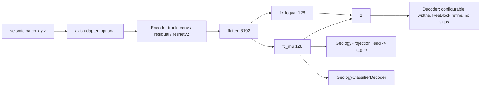

# Pretrain-v2 Encoder, Loss, Augmentation, and Real-Seismic Transfer — Implementation Plan

Date: 2026-09-27
Parent plans:
[2026-09-25__geology_classifier_decoder_and_class_anchored_sampling_plan.md](2026-09-25__geology_classifier_decoder_and_class_anchored_sampling_plan.md),
[2026-09-01_geo-aware_improvement_plan.md](../training/2026-09-01_geo-aware_improvement_plan.md) (parent-plan lever D2, bigger encoder)
Source repo: `/Users/donaldpg/synthoseis-pretrain-v2` (reconstruction-only 3D ResNetV2 U-Net)

This plan is written so a Copilot agentic model can implement it autonomously, one work
package (WP) at a time, with a test gate and a benchmark gate after each. Decisions made with
the user on 2026-09-27 are recorded in Section 10.

---

## 1. Goal and how it maps to the parent plans

**Primary goal (unchanged):** better geology retrieval with cosine similarity of `z_geo` in the
`seismic_tokenizer`.

- **Primary metric:** `diagnostics.neighbor_overlap_at_5` (n@5), tie-broken by n@10, on a
  **new frozen 7-key manifest** built from new validation volumes that neither repo has trained
  on (WP0, decision D2): `docs/benchmarks/frozen_validation_manifest_v2.json`. The old manifest
  is kept for historical comparison only. A result must hold for **two seeds** before it is
  adopted.
- **Current adopted model:** `checkpoints/geoaware_v3_phase2_20260831/vae_epoch20.pt`
  (old manifest: n@5 0.1385, n@10 0.2269). Best leak-free experimental: R2 seed 1 epoch 30
  (old manifest: n@5 0.1346). Both are re-benchmarked on the new manifest in WP1 and those
  values become the baselines.
- **Reconstruction guardrails:** synthetic `val_loss` within 2% of the baseline on the same
  validation set and loss configuration (as before), **plus a new real-seismic test MAE**
  (Section 7).
- **Target:** n@5 in the 0.18–0.25 band.

The 2026-09-25 plan concluded that the current architecture has plateaued at about 0.13–0.14 and
that a structural change is needed. Pretrain-v2 already searched encoder structure, loss mixes,
and augmentations for seismic reconstruction. This plan brings those results into this repo
**without** giving up the geology-aware parts (projection head `z_geo`, SupCon, classifier
decoder, class-anchored sampling, label-driven batch sampler).

| This plan | Parent-plan lever | Why it should help n@5 |
|---|---|---|
| Configurable, deeper, wider ResNetV2 encoder (optional pretrain-v2 weight transfer) | D2 bigger encoder | Current conv trunk has only 0.21 M parameters; nearly all 3.46 M parameters are in the flatten→FC layers. A stronger trunk gives `mu` richer structure for `z_geo`. |
| MAE-dominant multi-component reconstruction loss (+ small LPIPS / TV / GDL) | Reconstruction anchor quality | Best pretrain-v2 recipes; GDL keeps fault and reflector edges. |
| Seismic-physics augmentations (phase rotation, angle stacks, stretch, time-to-depth, noise) | A. more diverse data | Invariance to wavelet, angle, and velocity. Same-location views are natural SupCon positives. |
| Real seismic for reconstruction only | A. more diverse data | Moves the encoder toward field data; no geology labels are needed. |

Out of scope: U-Net skip connections into the reconstruction decoder (Section 3.3) and changing
the tokenizer latent contract (`latent_dim` 128, `mu`, `z_geo`). The geology decoders stay and
are extended (Section 3.5).

---

## 2. Evidence this plan is based on

### 2.1 Best pretrain-v2 runs (`/Volumes/CrucialX9/pretrain_v2_checkpoints/epoch_component_metrics3a.xlsx`)

2,333 epoch rows from 60 run folders. Column **AY** = rank of the sum of per-component ranks on
train + validation (synthetic plus a few real patches); column **BA** = the same rank on the
**real-seismic test** set (CostaRica, Poseidon part 1/2, cn1). Lower is better. BA exists only
for the later epochs (after the test loader was added).

| Run (short) | Levels | Hidden dims | Encoder blocks | Params (M) | Loss weights | Best AY (epoch) | Best BA (epoch) | Val MAE | Test MAE |
|---|---:|---|---|---:|---|---:|---:|---:|---:|
| r011 (0622) | 4 | 32 64 128 256 | baseline 3 4 6 3 | 58.9 | MAE 0.99 + GDL 0.01 | **1** (29) | 7 (96) | 0.269 | **0.323** |
| r001 (0621) | 4 | 40 74 138 256 | deeper 3 4 8 4 | 72.1 | MAE 0.995 + LPIPS 0.005 | **2** (55) | 5 (54) | 0.268 | 0.327 |
| r001 (0619) | 4 | 40 74 138 256 | deeper 3 4 8 4 | 72.1 | MAE 0.995 + LPIPS 0.005 + TV 0.001 | 3 (28) | 10 (60) | 0.273 | 0.331 |
| r006 (0620) | 3 | 32 64 128 | deeper 3 5 8 | **17.0** | MAE 0.995 + LPIPS 0.005 | 4 (25) | **1** (51), **2** (56) | 0.272 | 0.327 |
| r007 (0621) | 4 | 40 74 138 256 | deepest 3 5 8 5 | 74.6 | MAE 0.999 + GDL 0.001 | 4 (28) | 3 (86) | 0.271 | 0.325 |
| r004 (0620) | 3 | 40 80 160 | deeper 3 5 8 | 26.6 | MAE 0.995 + LPIPS 0.005 + TV 0.001 | 15 (55) | 3 (56) | 0.271 | 0.331 |
| copilot_2 | 3 | 40 88 176 | deeper 3 5 8 | 31.4 | MAE 0.995 + LPIPS 0.005 + TV 0.001 | 7 (71) | — | 0.268 | — |

Findings:

1. **MAE carries almost all of the weight (0.99–0.999).** The helpers are tiny: LPIPS 0.005,
   TV 0.001, or GDL 0.001–0.01. MSE and PMSE are 0 in every top run. The sweep also tried LPIPS
   0.01–0.10; none of those reached the top.
2. **"Deeper" profiles beat "baseline"** in 6 of 7 top runs. The one baseline winner (r011) uses
   GDL 0.01.
3. **The smallest model generalizes best to real seismic.** r006 (3 levels, 32-64-128, deeper,
   17.0 M) holds BA ranks 1 and 2. Larger 4-level models do not win on real test data.
4. The **kernel schedule** is `3 3 3(3)` in every row. In pretrain-v2 it only changes the decoder
   refinement blocks, so it is not a useful search axis here.
5. LR at the best epochs is about 1e-5 to 3e-5 (Adam, poly decay, base 1e-5 or 5e-5).
6. Real-test MAE (~0.323–0.331) is about 0.06 above synthetic val MAE (~0.27): a domain gap.

### 2.2 The two repos side by side

**Network**

| Aspect | synthoseis-3dvae-poc (this repo) | synthoseis-pretrain-v2 |
|---|---|---|
| Task | VAE: masked input → flat latent (128) → clean reconstruction; `z_geo` for retrieval | U-Net: masked input → clean reconstruction; no latent bottleneck, no KL |
| Patch | 32×32×64, axes (x, y, z) | 128×128×128, axes (z, x, y) |
| Encoder trunk | 5 × `Conv3dBlock` (or `ResidualConv3dBlock`), widths 16-32-32-64-64, /8 | ResNet50V2: stem 7³ s2 + maxpool (/4), bottleneck stages (expansion 4), stride 2 from stage 2 |
| Norm / activation | BatchNorm3d / GELU | InstanceNorm3d (affine) / ReLU pre-activation; GELU in decoder |
| Depth | 1 block per layer | per-stage blocks: baseline 3 4 6 3, deeper 3 5 8 or 3 4 8 4, deepest 3 5 8 5 |
| Bottleneck | flatten 64×4×4×8 = 8,192 → `fc_mu`/`fc_logvar` (1.05 M params each) | none (skip connections) |
| Decoder | FC → 3 × (trilinear up + `Conv3dBlock`), optional deep supervision | trilinear up + conv + skip concat + `ResBlock3d` per level |
| Params | 3.46 M (trunk 0.21 M) | 17–75 M (encoder 5.6 M for r006) |
| Extra heads | `GeologyProjectionHead` (`z_geo`), `GeologyClassifierDecoder` | segmentation head swap (fine-tune) |

**Losses**

| Loss | 3dvae-poc | pretrain-v2 | Common? |
|---|---|---|---|
| MSE / PMSE | `mse_pmse` blend (`--loss_mse_weight`) | `--mc_mse_weight`, `--mc_pmse_weight` (0 in top runs) | yes (same PMSE definition) |
| MAE | `--reconstruction_loss mae` (weight 1) | `--mc_mae_weight` 0.99–0.999 | yes |
| LPIPS | `--lpips_weight` 0.1 (current recipe), alex, **2 vertical mid-planes** (inline, crossline) | 0.005, alex, **3 orthogonal mid-planes** (adds the time slice), plus optional amplitude-calibration term | yes, different planes and weight |
| TV | — | `--mc_tv_weight` (0.001) | pretrain-v2 only |
| GDL | — | `--mc_gdl_weight` (0.001–0.01), gradient-magnitude difference on 3 axes | pretrain-v2 only |
| Loss validity mask | — | geometric mask from stretch/squeeze edges | pretrain-v2 only |
| KL | warmup to 1e-3 | — | poc only |
| Deep supervision | optional | — | poc only |
| Geology SupCon, uniformity, metadata alignment, classifier BCE/focal + dip CE | yes | — | poc only |

**Augmentations**

| Augmentation | 3dvae-poc | pretrain-v2 | Label impact (for geology-aware training) |
|---|---|---|---|
| Flip x, flip y, swap x↔y (p 0.5 each) | yes | yes | presence and dip magnitude unchanged |
| Extrema-only / sparse keep / decimate+trilinear input (one of three) | yes | yes | input only |
| Trace-cluster dropout | yes (8–12 traces) | yes (ratio 0.07, cluster p 0.8) | input only |
| Extrema mixup from a second patch | yes (p 0.10) | — | input only |
| Piecewise vertical warp | yes (p 0.5, local step 0.5–2.0) | — | changes apparent dip; dip labels now adjusted (Section 5) |
| Constant phase rotation | — | triangular(−60°, 0°, 40°), every sample | none |
| Random angle stack (5°, 17°, 29°, fullstack) | — (fullstack only) | yes, random key per sample | none (same geology) |
| Anisotropic stretch/squeeze | — | x, y ∈ [0.8, 1.25], z ∈ [0.667, 1.5]; extract larger block for squeeze; validity mask | changes apparent dip and object size; presence can change at borders |
| Time-to-depth (depth-dependent z stretch) | — | p 0.6, velocity gradient 0.3–0.8 | changes apparent dip |
| Gaussian noise (2% of std) | — | present in code, not in the training path | none |
| Normalization | `--input_scaling divide_by_std` | divide by pre-augmentation std, no mean removal | same |

**Data and training**

| Aspect | 3dvae-poc | pretrain-v2 |
|---|---|---|
| Synthetic source | pre-sampled 32×32×64 zarr patches (25 GB per 108 k set) from the 180 training volumes (runs 1041–1220), excluding `fake_data/validation` | on-the-fly crops from full volumes (runs 1000–1239, 10 new volumes per pass) |
| Real seismic | none | train: `/Users/donaldpg/synthoseis/real_data` (Netherlands1–4 `.real.zarr`, key `volume`); test: `/Users/donaldpg/synthoseis/fake_data/test` (CostaRica_part1, Poseidon_part1/2, cn1). This plan adds Penobscot3D to training (D6). |
| Optimizer / LR | AdamW 5e-4, `--encoder_lr_mult` 0.1, plateau scheduler | Adam 1e-5 to 5e-5, poly decay with 5-epoch warmup, `lr_min` 5e-6 |
| Batch | 12 | 1–2 (128³) |
| Regularization | weight decay 1e-4, grad clip 2.0 | grad clip 1.0, EMA 0.999 |

### 2.3 Facts checked for this plan

- Pretrain-v2 checkpoint layout: keys `model`, `ema_state`, `optimizer`, `train_paths`,
  `val_paths`; the encoder is under the `encoder.*` prefix
  (`encoder.stem_conv`, `encoder.stages.{i}.blocks.{j}.*`). For r006 the encoder has 5.56 M
  parameters.
- With the pretrain-v2 3-level encoder (/16) a 32×32×64 patch becomes 2×2×4 with
  128 × 4 = 512 channels, so the flattened size is **8,192, the same as today**. `fc_mu` and
  `fc_logvar` keep their shape.
- Real volumes are `.real.zarr` with a single array `volume` (e.g. cn1 `(400, 701, 600)` float32)
  and attr `volume_std`.
- Synthetic volumes contain all four stacks: `seismicCubes_cumsum__5_degrees`,
  `__17_degrees`, `__29_degrees`, `seismicCubes_cumsum_fullstack`.
- **Overlap:** pretrain-v2 trained on runs 1000–1239 (loop state `start_index_next` 1240).
  This repo's validation volumes are runs 0570–0574, 1040, and 1221–1239, so 20 of the 25
  validation volumes were seen (seismic only, no labels) by the pretrain-v2 models. Decision D2:
  generate new validation volumes and re-freeze the manifest (WP0).
- The old manifest has 512 examples but only **52 eligible queries**, which is why n@5 is noisy.
  `scripts/evaluate_geology_benchmark.py` creates a manifest when the path does not exist
  (`--benchmark_size`, default 512, `--seed`).
- One synthetic volume folder is about 3.1–3.2 GB. `/Volumes/CrucialX9` has **964 GiB free**
  (49% used); the internal disk has 128 GiB free and `data/` already uses 86 GB.
- Penobscot3D (`/Volumes/CrucialX9/real_data/Penobscot3D/Penobscot3D.real.zarr`, key `volume`):
  shape (601, 481, 901), attr `axis_order` = inline, crossline, z (same (x, y, z) order as the
  synthetic data), `volume_std` 1816.7. Amplitudes span about −32,058 to 32,767, so the
  strongest peaks are clipped at the int16 limit; about 5.6% of samples in a probe block are 0.
  It is a different basin (Nova Scotia) from the Netherlands training volumes.
- In this repo `vertical_warp` changes apparent dip but `meta_dip_mean_class` and
  `meta_dip_range_class` were precomputed and not adjusted (fixed 2026-09-27, Section 5).
- **Why 5 old validation volumes have no labels:** synthoseis `main.py --zarr-out` controls which
  arrays are kept. `essential` keeps only the 4 seismic stacks and `geologic_score`;
  `segmentation` also keeps every label array this repo needs (`fault_segments_id`,
  `fault_intersection_segments`, `faults/faulted_channel_labels`, `closure_segments_id` and the
  closure masks, `onlap_segments`, `faulted_lithology`, `flat_spot`, `geologic_age_faulted`).
  `~/synthoseis-pre-train/generate_datasets.sh` (May 22) passes `--zarr-out essential`;
  `/Users/donaldpg/synthoseis-pretrain-v2/generate_datasets.sh` (Jul 22) passes
  `--zarr-out segmentation`. Runs 0570–0574 (May 31) were made with the old script, so their
  labels were deleted at generation time. `scripts/sample_patches.py` can only copy labels that
  exist in the source volume, so it skips those volumes (`skipped_volumes_missing_labels`).
  Note: `run_top10_retrain_loop.py` still defaults `--generate-script` to the old script.

---

## 3. Architecture



### 3.1 Configurable encoder (`src/model.py`)

New constructor flags, saved in the checkpoint config. Defaults reproduce today's model exactly.

| Flag | Default | Meaning |
|---|---|---|
| `--encoder_arch {conv,residual,resnetv2}` | `conv` (`residual` when `--residual_encoder` is set) | trunk type |
| `--encoder_hidden_dims` | none → `base_ch` rule | per-stage widths, e.g. `32 64 128` |
| `--encoder_depth_profile {baseline,deeper,deepest}` | `baseline` | same tables as pretrain-v2 |
| `--encoder_stage_blocks` | none | explicit override, e.g. `3 5 8` |
| `--encoder_norm {batch,instance,group}` | `batch` for conv/residual, `instance` for resnetv2 | normalization |
| `--encoder_stem {pretrain_v2,light}` | `pretrain_v2` | 7³ s2 + maxpool (/4), or 3³ s2 with no maxpool (/2, keeps more resolution for the small patch) |
| `--decoder_hidden_dims` | none → `base_ch` rule | decoder widths, deepest first |
| `--decoder_block {conv,res}` | `conv` | `ResBlock3d` refinement as in pretrain-v2 |

`resnetv2` reuses the pretrain-v2 classes (`BottleneckV2_3d`, `ResNetV2Stage3d`,
`ResNet50V2Encoder3d`), copied into `src/encoders_resnetv2.py` with a provenance comment so this
repo does not import the other repo. The encoder computes `flat_dim` from a dry forward pass
instead of the `/8` formula, so any stem and stage combination works as long as every patch axis
is divisible by the total stride.

Candidate encoders (all keep `latent_dim` 128):

| ID | Arch | Stem | Widths | Blocks | Feature map at 32×32×64 | Flat dim | Notes |
|---|---|---|---|---|---|---:|---|
| E0 | conv | — | 16-32-32-64-64 | 1 each | 64×4×4×8 | 8,192 | current |
| E1 | residual | — | 16-32-32-64-64 | 1 each | 64×4×4×8 | 8,192 | exists, not tested with geology losses |
| E2 | resnetv2 | pretrain_v2 | 32 64 128 | deeper 3 5 8 | 512×2×2×4 | 8,192 | r006 layout; **weight transfer possible** |
| E3 | resnetv2 | light | 32 64 128 | deeper 3 5 8 | 512×4×4×8 | 65,536 | more spatial detail; 8.39 M weights in each latent projection; stem not transferable |
| E4 | resnetv2 | pretrain_v2 | 40 80 160 | deeper 3 5 8 | 640×2×2×4 | 10,240 | r004 layout, transfer possible |

4-level pretrain-v2 encoders reduce 32×32×64 to 1×1×2, which is too small; they are not used
because the patch size stays 32×32×64 (D3).

**Normalization note:** InstanceNorm at the last stage of E2 normalizes over only 16 voxels.
Add a unit test that the outputs are finite and non-constant for low-variance patches, and keep
`--encoder_norm group` as a fallback.

### 3.2 Pretrained encoder transfer (`--init_encoder_from`)

- Load `ema_state` if present, else `model`, from a pretrain-v2 checkpoint; copy only
  `encoder.*` keys into `encoder.trunk.*`. Fail with a clear message if any shape differs.
- **Axis adapter:** this repo feeds (B, 1, x, y, z); pretrain-v2 expects (B, 1, z, x, y). Add
  `--encoder_input_axes {xyz,zxy}`. `zxy` permutes the input inside the encoder
  (`x.permute(0, 1, 4, 2, 3)`), so no weight permutation is needed and the latent contract is
  unchanged.
- `fc_mu`, `fc_logvar`, decoder, heads are newly initialized.
- Schedule: `--freeze_encoder_epochs N` (default 0). Freeze the trunk for N epochs so the new FC
  and decoder settle, then unfreeze with `--encoder_lr_mult 0.1`.
- Record `init_encoder_from`, its epoch, and its `train_paths` count in the checkpoint config.

### 3.3 Why U-Net skip connections are not adopted

Skip connections let the decoder rebuild the patch from encoder feature maps and bypass the
latent. That lowers reconstruction loss but empties `mu`, which is what `z_geo` and the
classifier read. The decoder stays skip-free. Only the pretrain-v2 **decoder refinement block**
(`ResBlock3d`) is borrowed.

### 3.4 Compatibility

- `scripts/train.py` resume / warm-start allowlist: a checkpoint with a different
  `encoder_arch` cannot be resumed into another arch; fail clearly. Same-arch resume must be
  exact.
- `src/tokenizer/core/model_adapter.py` must build `VAE3D` from the new config keys when they are
  present and fall back to `base_ch` for old checkpoints. Required keys stay
  `model_state_dict, patch_shape, latent_dim, base_ch`.

### 3.5 Geology decoders (kept and extended)

The model keeps decoders for more than reconstruction:

- **Patch classifier decoder** (`GeologyClassifierDecoder` on `mu`: 7 presence logits + dip-mean
  and dip-range classes) is on in **every** geology run and works with every encoder E0–E4 (it
  only needs `mu`, which is 128-d for all of them).
- **Also in reconstruction stage 1** of P5–P8, at `--geology_classifier_weight 0.05`, so `mu`
  is shaped by geology while the new trunk is trained, not only in stage 2. Real samples are
  masked out of it (Section 6.2). P5 is run with and without this term (P5a / P5b).
- **Voxel geology decoder** (parent-plan WP6 design, moved into this plan as WP8 / run P9): a
  skip-free decoder from `mu` with 7 output channels at full patch resolution, focal (γ = 2) +
  soft Dice per class, water masked from the sand loss. It reads `mu`, not encoder feature maps,
  for the same reason as Section 3.3: skips would let it bypass the latent used for retrieval.
  It needs `sample_patches.py --store_label_patches` (uint8, ~1.75× the patch storage, ~44 GB
  for a 108 k set) written to `/Volumes/CrucialX9`, because the internal disk has 128 GiB free.
- All decoder heads are separate modules; the tokenizer adapter keeps ignoring
  `geology_classifier.*` and the new `geology_voxel_decoder.*` keys.

---

## 4. Loss (`scripts/train.py`)

### 4.1 Multi-component reconstruction

New choice `--reconstruction_loss multi_component` (existing `mse_pmse` and `mae` keep working):

```
recon = w_mse·MSE + w_pmse·PMSE + w_mae·MAE + w_tv·TV(pred) + w_gdl·GDL(pred, target)
total = recon + lpips_weight·LPIPS + kl·KL
      + geology_contrastive_weight·SupCon(z_geo) + geology_classifier_weight·L_cls   (unchanged)
```

| Flag | Default | Notes |
|---|---|---|
| `--recon_mse_weight`, `--recon_pmse_weight`, `--recon_mae_weight` | 0, 0, 1 | same definitions as pretrain-v2 `losses.py` |
| `--recon_tv_weight` | 0 | mean absolute finite difference on 3 axes, averaged |
| `--recon_gdl_weight` | 0 | mean over 3 axes of `| |∇pred| − |∇target| |` |
| `--lpips_planes {vertical,orthogonal}` | `vertical` | `orthogonal` adds the mid time slice (pretrain-v2 behavior) |
| `--recon_valid_mask` | on when geometric augmentation creates edges | loss only over valid voxels |

Deep supervision applies the same `recon` to each auxiliary output. Log each component
separately (`train_mae`, `train_mse`, `train_pmse`, `train_lpips`, `train_gdl`, `train_tv`, and
`val_*`, `real_val_*`, `real_test_*`) so runs can be ranked like the spreadsheet.

### 4.2 Recipes to test

| ID | MAE | LPIPS | TV | GDL | Source |
|---|---:|---:|---:|---:|---|
| L0 | 1.0 | 0.1 | 0 | 0 | current poc recipe |
| L1 | 0.995 | 0.005 | 0 | 0 | r006 / r001 |
| L2 | 0.995 | 0.005 | 0.001 | 0 | r004 / copilot_2 |
| L3 | 0.99 | 0 | 0 | 0.01 | r011 |
| L4 | 0.99 | 0.005 | 0 | 0.005 | combination (new) |

LPIPS on 32×32 vertical slices is upsampled to 64 (`--lpips_min_size`); on a 32×32 time slice it
is also upsampled. The v1b history showed LPIPS 0.1 kept improving slowly, so L0 stays as the
control rather than being dropped.

**Implementation status (2026-09-30):** only `--recon_mae_weight`, `--recon_tv_weight`, and
`--recon_gdl_weight` exist in `scripts/train.py` (added to run P1). `--recon_mse_weight`,
`--recon_pmse_weight`, `--lpips_planes`, and `--recon_valid_mask` are not implemented; P1 ran
with LPIPS on the existing vertical planes only and no valid-voxel masking. Per-component loss
logging (`train_mae`, `train_tv`, `train_gdl`, etc.) also does not exist; only the combined
`loss` value is logged. This was sufficient for P1 (no geometric augmentation was active, so
there were no invalid edge voxels to mask), but WP2 is not fully built. P5/P6 use the unchanged
P0b MAE + vertical LPIPS recipe with phase rotation and stretch disabled, so they do not require
orthogonal LPIPS or the geometric valid-voxel mask. Those WP2 features remain prerequisites for
any later run that explicitly enables them.

---

## 5. Augmentation (`src/augmentations.py`, `scripts/sample_patches.py`, `scripts/train.py`)

All new augmentations default to off. Geology labels are precomputed per patch, so each
augmentation declares its label rule.

| Aug | Flags (default) | Where | Label rule |
|---|---|---|---|
| Phase rotation | `--phase_rotation_prob 0`, `--phase_range -60 0 40` | train-time, on the clean patch before input masking (x and y both) | invariant |
| Angle stack | `sample_patches.py --stack_keys` (default and **current use: fullstack only**, D5), `--stack_mode {single,random_per_patch,all}` | sampling time | invariant; with `all`, same-origin stacks are extra SupCon positives |
| Gaussian noise | `--noise_prob 0`, `--noise_std_frac 0.02` | train-time, input only | invariant |
| Lateral/vertical stretch (zoom-in only, D4) | `--stretch_prob 0`, `--stretch_xy 1.0 1.25`, `--stretch_z 1.0 1.5` | train-time, zoom then center crop | dip classes per the dip rule; presence kept (small risk at borders) |
| Time-to-depth | `--t2d_prob 0`, `--t2d_velocity_gradient 0.3 0.8` | train-time | dip rule (below), with the t2d depth stretch |
| Existing vertical warp | unchanged flag | train-time | dip rule (below); **implemented 2026-09-27** |

**Dip and azimuth label rule (implemented 2026-09-27)** — `--dip_label_policy {adjust,mask,ignore}`,
default `adjust`; code in `src/geology_label_augment.py`, wired into `ZarrPatchDataset`:

- `adjust`: `sample_patches.py` now stores `dip_samples_deg` / `dip_samples_z` (512 random voxel
  dips and their z per patch, `--dip_sample_count`). A depth mapping with `s` output samples per
  source sample gives `tan(dip') = tan(dip) · s` and `s`× more voxels at that depth, so the
  samples are stretched and density-weighted; the change in mean / std / p90−p10 is added to the
  exact stored values and both dip classes (and `meta_structural_complexity`) are re-binned with
  the edges in the dataset attrs. Any depth mapping (vertical warp now; stretch and t2d later)
  only needs its per-depth `s`. Old datasets: `scripts/add_dip_samples.py --data <zarr>` fills
  the arrays from the source volumes (about 28 min per 108 k set) and checks the stored dips.
  Training fails with a clear message if `adjust` is needed and the arrays are missing.
- `mask`: dip-class targets become −1 for warped samples; the classifier loss skips them.
- `ignore`: previous behavior.
- Azimuth (`meta_azimuth_mean_deg`, when loaded) always follows x/y swaps and flips
  (swap: 90° − a; flip x: 180° − a; flip y: −a). Dip and circular variance do not change under
  flips or swaps.
- On `data/synth_val_uniform_32-32-64.zarr` the default vertical warp changed the dip-range class
  for 22% of warped patches and the dip-mean class for 2% (median |Δ dip range| 0.6°, p95 4.4°).

**SupCon metadata:** the 7 contrastive keys are fractions (fault, channel, flat spot, onlap,
intersection). They do not change under phase, stack, noise, flips, or small stretches, so strata
stay valid.

**Phase implementation status (2026-09-30):** the phase-rotation portion of WP3 is implemented
in `src/augmentations.py` and wired through `scripts/train.py`. It applies one triangularly sampled
angle per patch to both clean target and paired input before input-only masking. P2 uses
`--phase_rotation_prob 1.0 --phase_range -60 0 40`; the remaining WP3 augmentations and
stack-ready sampling are still pending and are not part of P2.

**Zoom-in stretch implementation status (2026-09-30):** paired trilinear zoom plus center crop
is implemented with `--stretch_prob`, `--stretch_xy`, and `--stretch_z`. XY uses one shared scale
so apparent dip follows the exact factor `s_z / s_xy`; sampled dip labels are adjusted under
`dip_label_policy=adjust`, including composition with the existing vertical warp. Scales below
1 are rejected, so no padding is possible. A real training-Zarr smoke test and the full 222-test
suite pass. P3 starts with seed `20260925`; seed `20260926` is gated on beating P0b n@5 0.0120.

**Context for squeeze (D4: zoom-in only):** pre-sampled patches have no margin, so only `s ≥ 1`
(zoom in and center crop) is implemented. No new data is needed. A `--context_margin` option
(48×48×96 stored patches, ~85 GB per 108 k set) is not part of this plan.

**Angle-stack expansion (D5):** runs in this plan use fullstack only, but the data format and
code must accept the 5°, 17°, and 29° stacks later without a format change:

- `sample_patches.py --stack_keys KEY [KEY ...]` (default `seismicCubes_cumsum_fullstack`). Attrs
  record `stack_keys` in order.
- `--stack_mode single` (default; one key), `random_per_patch` (one random key per origin, same
  storage), or `all` (every key at every origin; `patches` rows are grouped by origin).
- Per-patch arrays `stack_index` (int8, index into `stack_keys`) and `origin_id` (int64; equal for
  patches cut at the same location). With `single`, `stack_index` is all 0 and `origin_id` is the
  row number. Metadata and label arrays are computed once per origin and copied to each stack row.
- Training reads these arrays when present and defaults them when absent (old datasets).
- `origin_id` lets SupCon treat same-origin stacks as positives (`--supcon_same_origin_positive`,
  off by default) and lets the train/val split keep all stacks of one origin together.
- Model input stays 1 channel; stacks are separate samples, not channels.

---

## 6. Real seismic for reconstruction only

### 6.1 Sampling (`scripts/sample_patches.py --source_format real`)

- Read `.real.zarr` (array key `volume`) and `.npy` volumes. Confirm the axis order on each
  volume before sampling (expected (x, y, z) like the synthetic zarr); add `--real_axes` to
  override.
- Uniform patch origins, a minimum-std filter to skip dead/padded zones (`--min_patch_std`),
  `divide_by_std` scaling identical to synthetic.
- Write the same `patches` array plus `is_real=1`, `source_volume`, and no `meta_*` or
  `label_presence_*` arrays. Attrs record the source paths and split.
- Splits (D6): current pretrain-v2 split plus Penobscot3D **in training**.
  - Train: Netherlands1–4 (`/Users/donaldpg/synthoseis/real_data/*.real.zarr`) and Penobscot3D.
  - Validation: spatial hold-out blocks from each training volume (last 15% of inlines per
    volume, with a 32-sample buffer gap so no training patch overlaps a validation patch).
  - Test: `/Users/donaldpg/synthoseis/fake_data/test` (CostaRica_part1, Poseidon_part1/2, cn1),
    unchanged, so results stay comparable to pretrain-v2 column BA.
  - Why Penobscot goes to training: all current real training data come from one basin
    (Netherlands, about 620 M samples). Penobscot adds about 260 M samples (+42%) from a second
    basin, which targets the real-data domain gap in Section 2.1. The test set already covers
    three other regions and real-test MAE is only a guardrail (D7), so a separate out-of-basin
    validation volume adds less than the extra training diversity.
  - Penobscot handling: skip patches with more than 5% zeros or with clipped samples
    (|value| ≥ 32,000) above 1%; normalize per patch with `divide_by_std` like every other
    source.
- Balance: sample patches per volume in proportion to the square root of its sample count, so
  the largest volume does not dominate.

### 6.2 Training (`scripts/train.py`)

| Flag | Default | Meaning |
|---|---|---|
| `--real_data PATH` | none | real patch zarr (train) |
| `--real_validation_data PATH` | none | real val |
| `--real_test_data PATH` | none | real test, evaluated each epoch, never used for selection |
| `--real_batch_count K` | 0 | K real samples appended to each batch (e.g. 2 of 14) |
| `--real_recon_weight` | 1.0 | weight on the real part of the reconstruction loss |

- A per-sample `is_real` mask removes real samples from SupCon, uniformity, metadata alignment,
  classifier loss, geology strata, and hard-example mining. KL and reconstruction apply to all.
- The geology batch sampler builds the synthetic part exactly as now; the real part is drawn
  uniformly. The synthetic batch size stays 12 so the Phase 2 sampler settings stay valid.
- Augmentations on real patches: flips, swap, phase, noise, input masking. No label rule needed.
- Checkpoint selection stays on synthetic `val_loss` + n@5; `real_test_mae` is a guardrail.

---

## 7. Metrics and acceptance gates

| Metric | Role | Gate |
|---|---|---|
| n@5 (then n@10), **v2 frozen manifest**, `z_geo` | primary | > current best in **2 of 2 seeds** |
| synthetic `val_loss` (v2 validation set, same loss config) | guardrail | not worse than +2% |
| `real_test_mae` (new, 4 test volumes) | guardrail (D7) | not worse than the arm's control by more than 2%; report the delta |
| classifier macro AUROC (natural prevalence) | sanity | ≥ 0.75 target (not yet met; report) |
| component metrics (MAE, MSE, PMSE, LPIPS, GDL) on train / val / real test | diagnostics | spreadsheet-style rank-sum across runs |

Loss mixes change the value of `val_loss`, so compare recipes on **val MAE** (a fixed metric),
not on `val_loss`.

---

## 8. Work packages

Each WP ends with new/updated stdlib `unittest` tests passing, the full suite passing
(`.venv/bin/python -m unittest discover -s tests`), and, where training is involved, a benchmark
on the frozen manifest.

### WP0 — New leak-free validation volumes and v2 manifest (D2)

- Generate **25 new labeled synthoseis volumes** with run indices **5000–5024**. These satisfy
  “≥ 1240” and stay far from the pretrain-v2 retrain loop, whose next start index is 1240, so a
  future loop pass cannot train on them. Record this range in the session summary and never use
  5000+ as a pretrain-v2 start index.

  ```bash
  /Users/donaldpg/synthoseis-pretrain-v2/generate_datasets.sh -n 25 \
    --synthoseis-dir ~/synthoseis/synthoseis \
    -d /Volumes/CrucialX9/fake_data_validation_v2 \
    --start-index 5000
  ```

  Use this script (it passes `--zarr-out segmentation`), **not**
  `~/synthoseis-pre-train/generate_datasets.sh` (`--zarr-out essential` deletes the labels).
  Before the full batch, generate one volume and confirm it has every array in
  `LABEL_CLASS_SOURCES` plus `geologic_age_faulted`.

  Output goes to a folder **outside** `fake_data`, so `sample_patches.py`'s `rglob` over the
  training source cannot pick it up. About 80 GB (25 × ~3.2 GB); 964 GiB free.
- Check that every new volume has the label arrays (5 of the old 25 did not); regenerate any
  that do not. Check `label_z_offset` = 1 with `scripts/verify_label_alignment.py` on 5 volumes.
- Sample two validation patch sets from the new volumes:
  - `data/synth_val_v2_32-32-64.zarr`: same sampling settings as
    `data/synth_val_32-32-64.zarr` (copy them from its attrs) for the retrieval benchmark.
  - `data/synth_val_v2_uniform_32-32-64.zarr`: uniform, natural prevalence, 200 per volume, for
    `val_loss` and classifier metrics.
- Freeze `docs/benchmarks/frozen_validation_manifest_v2.json` with
  `scripts/evaluate_geology_benchmark.py --manifest <v2 path> --benchmark_size 2048 --seed 20260927`.
  2048 examples should give about 4× the 52 eligible queries of the old manifest, which narrows
  the n@5 interval. Report the eligible-query count.
- Keep the old manifest and old validation patch sets untouched for historical comparison.
  The old validation volumes are **not** training data for this plan.
- **Training data:** the 180 labeled synthoseis datasets in `/Volumes/CrucialX9/fake_data`,
  excluding the nested `validation` folder. This is the existing
  `data/synth_train_anchored_32-32-64.zarr` set: 108,000 patches at 600 per volume, with
  metadata, one-hot `label_presence_*` targets, and dip samples.
- **Validation data:** the 25 new datasets in `/Volumes/CrucialX9/fake_data_validation_v2`,
  sampled into `data/synth_val_v2_32-32-64.zarr` and
  `data/synth_val_v2_uniform_32-32-64.zarr`. They are never added to training.
- The five old unlabeled datasets under `fake_data/validation` remain ignored. The old
  validation folder is not used for the new training/validation split.
- **Reconstruction test data:** use only real seismic patches sampled from
  `/Users/donaldpg/synthoseis/fake_data/test` (CostaRica, Poseidon, cn1), not the synthetic
  validation datasets. Real seismic contributes reconstruction metrics only; it has no geology
  classifier labels.
- The canonical synthetic training patch set is `data/synth_train_anchored_32-32-64.zarr`.
- Tests: training-source listing never includes `fake_data_validation_v2`; manifest creation is
  deterministic for a seed; the benchmark refuses a manifest whose `dataset_size` does not match
  the data.

### WP1 — Metrics parity and real-test evaluation (no training)

- Add per-component metric logging (Section 4.1) with loss weights at 0 by default.
- Add `scripts/evaluate_real_reconstruction.py`: loads a checkpoint, runs a real patch zarr,
  writes MAE/MSE/PMSE/LPIPS/GDL JSON.
- Real sampling (Section 6.1): real train (Netherlands1–4 + Penobscot3D), real val (spatial
  hold-out), real test (4 volumes).
- Re-benchmark the adopted checkpoint and R2 seed 1 ep 30 on the **v2 manifest**: n@5, n@10,
  val MAE, real test MAE. These are the P0 reference numbers.
- Tests: GDL is 0 for identical tensors and positive for a shifted edge; TV of a constant is 0;
  component logging does not change `total` when weights are 0 (regression); real sampler writes
  no label arrays, skips low-std / high-zero / clipped patches, and the spatial hold-out has no
  overlap with training origins.

### WP2 — Multi-component reconstruction loss

- Section 4.1: flags, masked loss, orthogonal LPIPS planes.
- Tests: `multi_component` with `mae=1` equals `--reconstruction_loss mae` exactly; weights sum
  as expected; the valid mask excludes voxels; `orthogonal` produces 3 planes with the right
  shapes for 32×32×64.

### WP3 — Augmentations with label rules, stack-ready sampling

- Section 5: phase rotation (vectorized rFFT along z), noise, zoom-in stretch, t2d, dip label
  policy, and the stack-ready data format (`stack_keys`, `stack_mode`, `stack_index`,
  `origin_id`) with fullstack as the only key used now.
- Tests: phase 0° is the identity and 180° equals negation; phase keeps the amplitude spectrum;
  stretch with s = 1 is the identity; zoom-in never pads; `mask` policy zeroes dip CE only for
  warped samples; `adjust` maps a 45° dip with s_z/s_xy = 2 to atan(2) = 63.4°.
- Stack-expansion tests on a small synthetic fixture with 4 stack arrays: `--stack_mode all`
  with 3 angle keys writes 3 rows per origin with equal `origin_id`, equal metadata and labels,
  and different patches; `random_per_patch` records the chosen `stack_index`; `single` output is
  identical to today's output for a fixed seed; an old dataset without `stack_index` /
  `origin_id` trains.
- Defaults leave training bit-identical for a fixed seed.

### WP4 — Real seismic in training

- Section 6.2.
- Tests: `is_real` samples contribute 0 to every geology loss and are never in strata; batch
  composition is 12 synthetic + K real; real-only metrics are logged; K = 0 is bit-identical to
  today.

### WP5 — Configurable encoder and decoder

- Section 3.1 and 3.4.
- Tests: E0 defaults produce a state dict identical to the current model (key names and shapes);
  E1–E4 forward on 32×32×64 with finite outputs and `mu` shape (B, 128); `flat_dim` from the dry
  run matches the table; InstanceNorm output finite for a low-variance patch; checkpoint round
  trip; tokenizer adapter loads each variant and returns the same `z_geo` as the training model;
  parameter count logged.

**Implementation status (2026-10-01):** `VAE3D` supports conv, residual, and ResNetV2 trunks,
configurable widths/depth/norm/stem/input axes, and a skip-free configurable decoder with conv or
ResNetV2 residual refinement blocks. Old E0 defaults retain their state-dict layout. The tokenizer
adapter reconstructs architecture-configured checkpoints. E1–E4 shape/latent/finite-forward tests,
low-variance normalization, and adapter parity tests pass.

### WP6 — Pretrained encoder transfer

- Section 3.2.
- Tests: all `encoder.*` tensors from a synthetic pretrain-v2-style state dict are copied
  exactly; a shape mismatch raises; `zxy` input axes give the same output as manually permuting
  the input; frozen epochs leave trunk weights unchanged and the optimizer skips them.

**Implementation status (2026-10-01):** `--init_encoder_from` prefers `ema_state.shadow`, copies
only `encoder.*` into `encoder.trunk.*`, and rejects missing, extra, or shape-mismatched tensors.
The real r006 checkpoint loaded all 150 encoder tensors (epoch 84; 10 `train_paths`). `zxy`
permutation, scheduled freezing/unfreezing, checkpoint provenance, and architecture-aware resume
checks are implemented. A two-epoch MPS smoke run loaded r006, trained with `K=0`, froze for one
epoch, unfroze, and completed; a second-stage resume also passed.

P5/P6 runners are `scripts/p5_encoder_transfer_suite.sh` (P5a/P5b) and
`scripts/p6_encoder_scratch_suite.sh`. They use the P0b recipe, disable phase rotation and
stretch, omit real training data (`K=0`), and use real validation/test stores only for MAE
guardrails. `PRINT_COMMANDS=1` renders commands without starting training.

### WP7 — Suite script and docs

- `scripts/pretrain_v2_transfer_suite.sh` with `set -euo pipefail`, one stage per run in
  Section 9, fail fast on missing inputs.
- Update `docs/training/README.md` with the new flags.
- Session summary `docs/sessions/2026-09-27-...md` (date-first).
- Do not commit benchmark manifests or milestone benchmark reports unless explicitly requested.

### WP8 — Voxel geology decoder (after P5–P8)

- Section 3.5; `--geology_classifier_mode {patch,voxel,both}` (the flag already exists and
  currently accepts only `patch`), `--geology_voxel_weight`, `--store_label_patches` output on
  `/Volumes/CrucialX9`.
- Tests: output shape (B, 7, 32, 32, 64); Dice loss is 0 for a perfect prediction; water voxels
  add nothing to the sand loss; real samples add nothing; tokenizer adapter ignores
  `geology_voxel_decoder.*` and returns the same `z_geo`.

---

## 9. Experiment sequence

One primary variable per run; two seeds for any candidate for adoption. "Warm-start" means the
Phase 2 recipe from the adopted checkpoint (decoder trainable, `--encoder_lr_mult 0.1`,
SupCon 0.5 / T 0.2, sampler background 0.05 / hard 0.30, uniformity 0), 20–40 epochs,
class-anchored train data (`data/synth_train_anchored_32-32-64.zarr`, 180 training volumes),
classifier weight 0.1 (R2 settings), `--dip_label_policy adjust`, validation on the v2
sets, unless stated.

| Run | Arm | Change vs control | Needs | Adopt / continue if |
|---|---|---|---|---|
| P0 | ref | Re-benchmark adopted + R2 seed 1 on the v2 manifest with new metrics | WP0, WP1 | sets the v2 baselines |
| P0a | ref | R2 recipe on the **old** 180-volume set (`synth_train_anchored_32-32-64`, dip samples backfilled) with `adjust` | WP0, WP1 | isolates the dip-label fix |
| P0b | ref | R2 recipe on the existing 180-volume training set, with the new v2 validation set, 2 seeds | WP0, WP1 | **control for P1–P4**; establishes the clean v2 holdout baseline |
| P1 | loss | Warm-start from P0b's recipe with L1, L2, L3, L4 (one each) | WP2 | n@5 ≥ P0b and val MAE / real MAE not worse; pick best recipe |
| P2 | aug | P0b unchanged + phase rotation (p 1.0, triangular −60°/0°/40°) | WP3 | n@5 up; else drop |
| P3 | aug | P0b unchanged + zoom-in stretch; keep dip policy `adjust`, omit rejected phase rotation | WP3 | n@5 up in two seeds; else drop |
| P4 | real | Best accepted current-architecture recipe (P0b unless P3 wins) + real recon (K = 2) | WP4 | real MAE down with n@5 not worse |
| P5 | arch | **E2 transfer**: two stages — P0b reconstruction recipe on synthetic data (60–150 epochs, trunk frozen first 5), then Phase 2 + classifier (40 epochs); phase/stretch off, no real mixing. P5a: stage 1 classifier weight 0.05; P5b: stage 1 weight 0 | WP5, WP6 | n@5 > best so far in 2 seeds |
| P6 | arch | E2 from scratch, same P0b two-stage recipe as P5a; phase/stretch off, no real mixing (control for transfer, D1) | WP5 | explains transfer gain |
| P7 | arch | E1 residual and E3 light stem, best of the P5/P6 pipeline | WP5 | n@5 > best so far |
| P8 | arch | E4 wider (40-80-160) transfer | WP5, WP6 | only if P5 wins |
| P9 | decoder | Best so far + voxel geology decoder (Section 3.5) | WP8 | n@5 > best so far in 2 seeds; voxel mean Dice reported |
| later | aug | 3 angle stacks (5°, 17°, 29°) with `--stack_mode all` + same-origin SupCon positives | WP3 format | separate follow-up (D5) |

**P0b status (2026-09-29):** completed with the 180-volume training set and the v2 validation
manifest. Seed `20260925` reached its best n@5 of **0.0120** at epoch 30 (n@10 0.0221,
best synthetic val loss 0.218987); seed `20260926` reached **0.0109** at epoch 30 (n@10
0.0167; its best synthetic val loss was 0.218169 at epoch 40). The adopted checkpoint's v2 reference is n@5
0.0102 / n@10 0.0178, and the P0a R2 seed-1 epoch-30 reference is n@5 0.0091 / n@10
0.0207. P0b therefore establishes the v2 baseline and is not a robust retrieval improvement
over the adopted model. Classifier macro AUROC was 0.639 and 0.635, below the 0.75 sanity
target. Proceed to P1's one-variable loss recipes, retaining the P0b checkpoints as controls;
do not start P2 augmentation or architecture work until a P1 recipe clears the n@5 and
reconstruction/real-seismic guardrails.

**P1 status (2026-09-30):** the first one-seed L1–L4 sweep completed. L1, L2, and L4 were
effectively tied: best n@5 **0.0099** at epoch 40 (n@10 0.0194). L3 peaked at n@5 **0.0109**
at epoch 20 (n@10 0.0177), but fell to 0.0078 by epoch 40. None exceeded both P0b seeds
(0.0120 and 0.0107), and classifier macro AUROC remained 0.632–0.649, below the 0.75 target.
The L3 replication at seed `20260926` completed with best n@5 **0.0096** at epoch 30
(n@10 0.0190; macro AUROC 0.657), so it did not reproduce the provisional gain. The loss
terms are therefore rejected as an adopted improvement. Retain P0b; do not start P2 augmentation
or architecture work from this P1 evidence. Any future change requires a new hypothesis and
fresh control rather than selecting an unsupported P1 recipe.

**P2 status (2026-09-30): rejected.** The phase-rotation portion of WP3 was implemented and
validated (218 tests passing), then P2 warm-started each seed from its matching P0b best
checkpoint using the actual P0b reconstruction recipe (`mae` plus LPIPS 0.1). Phase rotation
was the only recipe change: `--phase_rotation_prob 1.0 --phase_range -60 0 40`. Seed
`20260925` peaked at n@5 **0.0091** at epoch 40 (n@10 0.0163; macro AUROC 0.636), below its
P0b peak of 0.0120. Seed `20260926` peaked at n@5 **0.0122** at epoch 20 (n@10 0.0173;
macro AUROC 0.652), above its P0b peak of 0.0109. The best-per-run two-seed mean was 0.01065,
below P0b's 0.01145, and the gain did not reproduce across seeds. Do not adopt phase rotation
or carry it into P3/P4/P5–P8. Retain P0b as the control; no later experiment has been started.

**P3 status (2026-09-30): rejected.** Zoom-in stretch was implemented with paired trilinear
zoom/center crop, scales `s_xy ~ U(1, 1.25)` and `s_z ~ U(1, 1.5)`, phase rotation off, and
`dip_label_policy=adjust`. The real-data smoke check and all 222 tests passed. Seed `20260925`
peaked at n@5 **0.0130** at epoch 30 (n@10 0.0207; macro AUROC 0.628), clearing its P0b
0.0120 gate and triggering replication. Seed `20260926` peaked at only **0.0086** at epoch 10
(n@10 0.0169; macro AUROC 0.629), below its P0b 0.0109. The best-per-run mean was 0.01081
versus P0b 0.01146; the gain did not reproduce. Do not adopt or carry zoom-in stretch forward.

**P4 status (2026-10-01): rejected after seed 1.** WP4 now supports axis-aware real sampling,
square-root source allocation, quality rejection, per-patch standard-deviation scaling, and
buffered inline train/validation splits. Training appends `K` uniformly sampled real examples
to the unchanged synthetic batch and excludes their latent vectors from all geology and GAN
losses. The full suite passes (226 tests). P4 seed `20260925`, with `K=2`, phase rotation off,
and stretch off, peaked at n@5 **0.01094** and n@10 **0.01979** at epoch 20, below its P0b
control (n@5 0.01198, n@10 0.02214 at epoch 30). Real validation MAE moved from 0.71325 at
epoch 1 to a best of 0.70821; real test MAE moved from 0.67762 to a best of 0.67208. The real
reconstruction gain does not clear the primary geology-retrieval gate, so do not replicate P4
or carry real mixing into P5. Retain unchanged P0b as the current-architecture recipe.

**P5/P6 status (2026-10-03): completed, seed 20260925 only; not adopted.** All three arms
completed 60 reconstruction epochs, 40 geology epochs, and four frozen-manifest reports.
P5a best n@5 was 0.011719 at epoch 40 (n@10 0.019661; classifier AUROC 0.7755).
P5b best n@5 was 0.011198 at epoch 40 (n@10 0.020573; AUROC 0.7675).
P6 best n@5 was 0.010938 at epoch 30 (n@10 0.023177; AUROC 0.7677).
None beats P0b seed 20260925 n@5 0.011979. Best synthetic val losses were
0.356375/0.356796/0.354272, versus P0b 0.218987 (62-63% worse); best real-test MAEs
were 0.717662/0.710287/0.717474. These minima are not necessarily from retrieval-selected
epochs. A matching P0b real-test baseline still needs evaluation. Classifier improvement
does not qualify an arm for adoption. Retain P0b; pause replication and P8.

**Next recommended step (2026-10-03):** execute Section 9.2 reconstruction diagnostics.
P5/P6 changed the decoder as well as the encoder; do not attribute regression solely to
encoder capacity or presume a bug. P7 E1/E3 is considered after the diagnostic decision;
P8 still requires P5 to win. No long training run is authorized by this diagnostic package.

**Previous recommendation (2026-10-01; superseded):** P1–P4 have not produced a repeatable n@5 gain.
If continuing the transfer plan, proceed to the separately gated P5/P6 encoder comparison using
the unchanged P0b recipe, without phase rotation, zoom-in stretch, or real mixing. Do not select
P4 based on its real-MAE improvement because its primary frozen-manifest metric regressed.

P1–P4 are cheap warm-start runs on the current architecture and give the loss and augmentation
settings that P5–P8 then use. P5–P8 need a new reconstruction stage because the trunk changes;
the v1b history (2026-09-25 plan, Section 8.1) shows a from-scratch recon run needs hundreds of
epochs, which is why transfer (P5) is tried before from-scratch (P6). The multi-day budget
covers P5–P7 at two seeds each.

### 9.1 Example commands

Real test patches (WP1):

```bash
uv run python scripts/sample_patches.py \
  --source_format real \
  --source /Users/donaldpg/synthoseis/fake_data/test \
  --real_key volume \
  --patch_size 32 32 64 \
  --n_patches 4000 --n_per_volume 1000 \
  --min_patch_std 1e-3 \
  --seed 20260927 \
  --out data/real_test_32-32-64.zarr
```

Real train and validation patches (WP1), including Penobscot3D:

```bash
uv run python scripts/sample_patches.py \
  --source_format real \
  --source /Users/donaldpg/synthoseis/real_data /Volumes/CrucialX9/real_data/Penobscot3D \
  --real_key volume \
  --patch_size 32 32 64 \
  --n_patches 40000 --per_volume_weighting sqrt \
  --real_holdout_fraction 0.15 --real_holdout_gap 32 \
  --min_patch_std 1e-3 --max_zero_fraction 0.05 --max_clip_fraction 0.01 --clip_abs 32000 \
  --seed 20260928 \
  --out data/real_train_32-32-64.zarr \
  --holdout_out data/real_val_32-32-64.zarr
```

P5/P6 runner examples (two-stage, P0b recipe; real data is metrics-only):

```bash
SEED=20260925 scripts/p5_encoder_transfer_suite.sh
SEED=20260925 scripts/p6_encoder_scratch_suite.sh
```

Override `RECON_EPOCHS`, `GEOLOGY_EPOCHS`, `BATCHES`, `OUT_ROOT`, `PRETRAIN_CHECKPOINT`, or
`PRINT_COMMANDS=1` as needed. P5 runs both classifier ablations; P6 matches P5a from scratch.

---

### 9.2 Bounded P5/P6 reconstruction regression diagnostics (2026-10-03)

Run `bash scripts/p5_p6_reconstruction_diagnostics.sh` from the repository root. The script
uses `set -euo pipefail`, unbuffered Python, and `tee` to capture stdout and stderr in
`logs/p5_p6_reconstruction_diagnostics.log`. It must fail on missing inputs or failed
invariants and must not overwrite training checkpoints, the frozen manifest, or datasets.
Reports are disposable experiment artifacts, not committed benchmark milestones.

**Local hypothesis:** the changed skip-free decoder and/or insufficient reconstruction
training explains the regression; latent sampling, KL, or axis handling may instead account
for some of the measured gap. Existing shape tests alone cannot discriminate these causes.

**Inputs and fixed budget:** P0b seed 20260925 epoch 30, P5a/P5b epoch 40, and P6 epoch 30;
the v2 uniform validation store and existing real-test store. Use the same seed-selected
32 synthetic and 32 real patches for every checkpoint, batch size 2, seed 20261003.
Normalize with each store's declared scaling (never double-normalize normalized stores).
Use CPU by default for reproducible bounded work; threads=2. Allow explicit device and
sample/step overrides and record them. No augmentation or geology loss during evaluation.

1. Audit all six training CSVs: early/late MAE + LPIPS + KL validation losses, learning
  rates, minima and late trend. Report whether stage 1 was still improving at its end;
  this is evidence about undertraining, not proof that more epochs will fix retrieval.
2. Strictly load full reconstruction weights using saved architecture configuration.
  Check input/target/output shapes and finiteness. Verify zxy encoder permutation and
  the decoder inverse with an asymmetric coordinate fixture, not just equal shapes.
3. On identical patches evaluate `decoder(mu)` and seeded `decoder(z)` independently;
  report MAE, MSE, vertical LPIPS, per-example KL and training's voxel-normalized KL,
  reconstruction standard deviation,
  and zero-output MAE. Report the current recipe total (MAE + 0.1 LPIPS + 0.001 KL).
  Report synthetic/real deltas against P0b on these same patches; subset results are
  diagnostics only, not official +2% guardrail certification or adoption evidence.
4. Fit the existing checkpoint decoder for 40 steps on two fixed synthetic patches with
  cached, detached mu. Use MAE only, Adam at 1e-3, no encoder updates or checkpoint writes.
  Compare native P5a and P6 decoders with fresh legacy `Decoder` modules fed the same mu;
  include the trained P0b decoder as a sanity control. Log initial, every 10 steps, and
  final MAE and gradients. Compare learning progress, not just absolute endpoints: the
  fresh legacy decoder and trained native decoder have different initial conditions.
5. Emit a JSON report and a concise console summary. No definitive cause is inferred from
  a small subset or short fit. Axis/load failures block further experiments; a dominant
  sampled-minus-mean gap motivates a latent/KL investigation; poor native fitting relative
  to a fresh legacy decoder motivates an independently initialized decoder ablation;
  continuing late-stage improvement motivates a separately approved longer warmup.

**Test gate:** fixture tests for axis inversion, component/total arithmetic, deterministic
patch selection, and decoder-only fitting with encoder tensors unchanged; focused tests,
then `.venv/bin/python -m unittest discover -s tests`. Execute the actual bash diagnostic
and record its results in the session handoff. Do not start P7/P8 or modify production
architecture/loss defaults automatically. Official full-set reconstruction evaluation and
two-seed frozen-manifest retrieval gates remain required before adoption.

**Diagnostic result (2026-10-03 local date; executed 2026-10-04 UTC):** completed on CPU
with 32 patches per split and 40 fit steps. All axis and strict checkpoint-load checks passed.
Sampled versus mean MAE differences were below 0.0006; weighted KL was below 0.0001.
Neither explains the regression on this subset. Deterministic synthetic MAEs were
P0b 0.256640, P5a 0.463623, P5b 0.485695, P6 0.507599; real MAEs were
0.708492/0.753793/0.745650/0.749700. This randomly selected subset is not the original
training-validation prefix; do not equate these values with CSV val_loss or full-set gates.
Native decoder fitting reached 0.09077 (P5a) and 0.09098 (P6), versus fresh legacy decoder
0.15307/0.14429, with encoders unchanged. This disconfirms a simple inability of the native
decoder to fit two patches, but says nothing about held-out generalization or fair decoder
architecture superiority. Stage-1 best epochs were all 56/60; last-ten versus previous-ten
mean val losses improved 4.11%/1.59%/2.97%. Insufficient reconstruction training remains
plausible; no root cause or fix is proven. Next proposal: a separately approved extension
of P5a reconstruction warmup toward the planned 150 epochs, with matching component
evaluation and a reconstruction gate before new geology training. Do not automatically
launch P7/P8 or replication. The full diagnostic test gate passes 241 tests.

Progress command: `tail -n 50 -F logs/p5_p6_reconstruction_diagnostics.log`.
Report: `logs/p5_p6_reconstruction_diagnostics.json` (local artifact, not committed).

## 10. Decisions (answered 2026-09-27)

| ID | Decision | Answer |
|---|---|---|
| D1 | Architecture track | Both: transfer pretrain-v2 encoder first (P5), from-scratch control (P6) |
| D2 | Validation overlap with pretrain-v2 training | Generate new validation volumes (runs ≥ 1240; plan uses 5000–5024) and re-freeze a v2 manifest (WP0) |
| D3 | Patch size | Keep 32×32×64 |
| D4 | Stretch context | Zoom-in only (s ≥ 1), no new storage |
| D5 | Angle stacks | Fullstack only for now; data format and code must support the 5°, 17°, 29° stacks later (Section 5, WP3 tests) |
| D6 | Real data | Current pretrain-v2 split, plus Penobscot3D in **training** (reason in Section 6.1) |
| D7 | Real-test MAE role | Guardrail only |
| — | Budget | Multi-day runs acceptable. Disk: `/Volumes/CrucialX9` 964 GiB free (enough for the ~80 GB of new volumes); internal disk 128 GiB free with `data/` at 86 GB; the new 200-volume training set (~28 GB) and v2 validation sets (~2 GB) fit there |
| — | Training volumes | 180 datasets under `/Volumes/CrucialX9/fake_data`, excluding its `validation` subfolder |
| — | Old-set backfill | Only `synth_train_anchored_32-32-64` (for P0a); the other old sets are not used by this plan |

---

## 11. Robustness and readiness checklist

**Correctness**

- [ ] Default flags reproduce current training bit-for-bit for a fixed seed (loss, augmentation,
      model, real data all off).
- [ ] E0 state dict identical to the current `VAE3D`.
- [ ] Transferred encoder weights match the source tensors exactly; axis adapter verified.
- [x] Dip label policy applied to the existing vertical warp; azimuth follows flips/swaps
      (`tests/test_geology_label_augment.py`, 2026-09-27).
- [ ] Dip label policy applied to the new z-scaling augmentations (stretch, t2d).
- [ ] Real samples never enter geology losses or strata (tested).
- [ ] Real volume axis order confirmed per volume.

**Backward compatibility**

- [ ] Old checkpoints load in `train.py` and the tokenizer; new arch checkpoints load in the
      tokenizer and give the same `z_geo`.
- [ ] Old datasets (no `is_real`, no `stack_index` / `origin_id`) still train.
- [ ] Stack-expansion path (3 angle stacks) covered by fixture tests even though unused now.

**Evaluation discipline**

- [ ] New validation volumes (runs 5000–5024) are outside every training source of both repos.
- [ ] v2 manifest frozen once; old manifest and `data/synth_val_32-32-64.zarr` untouched.
- [ ] Recipes compared on val MAE and real test MAE, not on `val_loss` values from different
      loss mixes.
- [ ] Two seeds before adoption; bootstrap intervals reported for n@5.

**Operational**

- [ ] MPS memory and epoch time measured for E2/E3 at batch 12 + K real before long runs.
- [ ] Disk checked before each new dataset (CrucialX9: 964 GiB free on 2026-09-27; internal:
      128 GiB free).
- [ ] Suite script uses `set -euo pipefail`.

**Risks and mitigations**

| Risk | Mitigation |
|---|---|
| Pretrained encoder trained on 128³ patches does not suit 32×32×64 | frozen-trunk warm-up; E3 light stem; P6 from-scratch control |
| InstanceNorm unstable on 2×2×4 maps | test; `--encoder_norm group` fallback |
| Larger encoder overwhelms the 128-d bottleneck (information lost in FC) | compare E2 vs E3; optional 1×1 channel-reduction before flatten |
| Real data shifts the latent away from synthetic geology | `real_batch_count` small (2 of 14); n@5 gate |
| Augmentations make dip targets noisy | dip label policy `mask`/`adjust` |
| Old validation overlap with pretrain-v2 training | new v2 validation volumes (runs 5000–5024) and v2 manifest (WP0) |
| Many runs; n@5 noise with 52 queries | two seeds; one variable per run; stop an arm after no gain |
